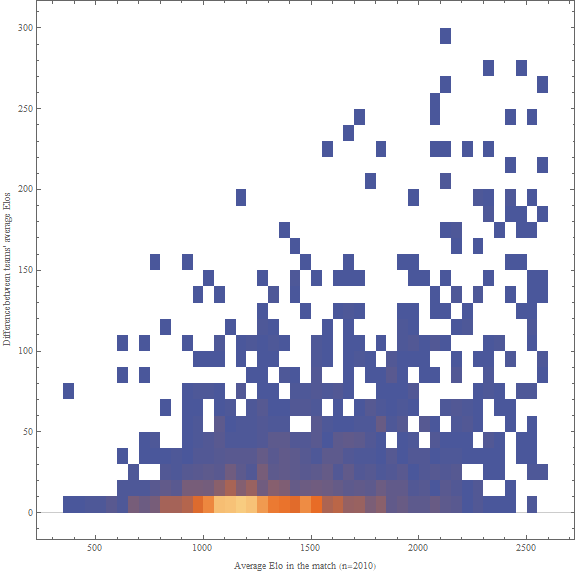
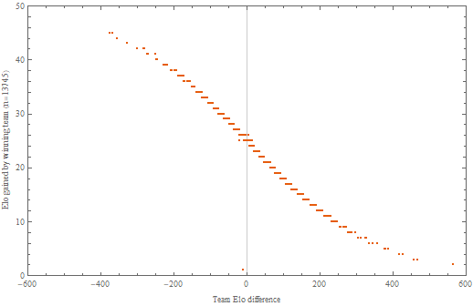
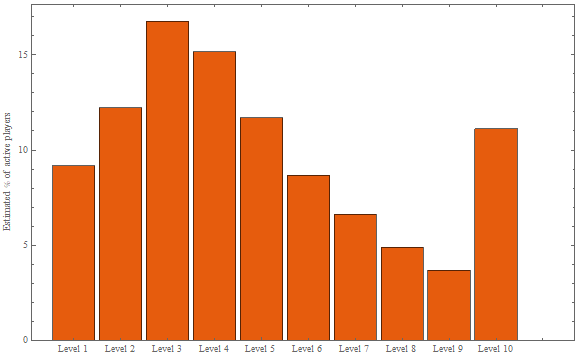

## An analysis of the rating system in FACEIT (CS:GO)
 
### 1. Introduction

FACEIT [\[1\]](#references) is a freemium matchmaking platform with support for multiple games. In this analysis, we will be concentrating on only one of the supported games, Counter-Strike: Global Offensive (CS:GO). Similarly to Valve's own matchmaking system inside CS:GO, FACEIT allows players to search and play 5v5 ranked competitive matches.

FACEIT tries to provide fair matchups by estimating players' skills with ratings. Doing my B.Sc. thesis on rating systems and having used FACEIT quite a bit, I decided to dig a bit deeper into the rating system they use.

**Research questions**

- How exactly does the rating system work? ([Chapter 3](#3-the-rating-system-in-faceit))
- How good are the matchups? ([Chapter 3](#3-the-rating-system-in-faceit))
- What is the rating distribution in FACEIT? ([Chapter 4](#4-distribution-of-rankings))
- Is your FACEIT rating a good predictor of skill? ([Chapter 5](#5-team-elo-as-a-predictor-of-skill))

I hope you enjoy the writeup and learn something new!

**Disclaimer**

*This analysis is not meant to harm or criticize FACEIT in any way but to provide information about the rating system to the vast number of players using their services. I do not work for FACEIT, I am not endorsed by them and I do not know the exact details of their system. Hence, please do take this analysis with a grain of salt.*

**Updates**

- 17-09-2020: Fixed an invalid statement about rating points
- 08-03-2020: Fixed the elo change vs. elo difference plot and analysis
- 26-02-2020: Updated plots to show the latest data
- 21-02-2020: Added another example of weird Elo data

### 2. Data collection and tools

FACEIT introduced a feature recently where anyone can see the Elo changes for a player's recent matches. This data is the basis for our analysis (Note Chapter 6.1). I started by sampling ongoing matches and later polling for their result after they had finished. For each player encountered I queried their profile, collecting the mentioned Elo history after each match. Knowing who participated in which games, participant ratings at the time of the match could be calculated for each match (FACEIT does not provide this information via their Data API). This data was then stored in an sqlite database for analysis.

Extra care was taken to be *nice* and not to overwhelm the APIs with queries. Some of the used APIs are public and some a part of the Data API which can only be accessed with a token requested from the developer portal. ~~The Python source code for data collection (*faceit.py*) and analysis (*plot.py*) can be found in this repository.~~ The historical source code can be found in the commits of this repository, but I've removed the files from the master branch since the files were not up-to-date and the code was frankly hacky and terrible (do not use as an example). As seeing the Elo history of a player is a FACEIT "Premium" feature, I've decided not to include the database which undoubtedly contains historical Elo data for many players. Finally, Mathematica was used to produce the graphs and charts.

**Remark**

Not all collected matches were used in the analysis. It is often meaningful to use the Team Elo values before the match (e.g. in the Team Elo difference plots) and we might not have the rating before match stored for all participants meaning that some matches are unsuitable for analysis. This is one clear source of error, but I'll argue that the effects of ignoring a small set of matches are negligible. See the plotting source code for how this is exactly handled.

### 3. The rating system in FACEIT 

**3.1 Rankings and levels**

Player ratings in FACEIT are called "Elo ratings". The name originates from Arpad Elo's rating system [\[2\]](#references) which was originally developed for chess but is now wildly used in online games (usually heavily modified). Since *Elo number* is nowadays used as a synonym for *rating*, we cannot yet assume that FACEIT actually uses Elo's system (though it is a good initial guess).

Every player on FACEIT has a single integer rating for CS:GO. I will often call this the Elo because that's what FACEIT calls it but keep in mind that until we prove otherwise, it might not be equivalent to the Elo rating in the original Arpad Elo's system. These ratings are mapped to levels [\[3\]](#references), 1 being the lowest level (below 801 Elo) and 10 being the highest level (above 2000 Elo). A new player has a rating of 1000 which equates to starting from level 3.

| Rank | Level |
|---|---|
| 1-800 | 1  |
| 801 - 950 | 2  |
| 951 - 1100 | 3  |
| 1101 - 1250 | 4  |
| 1251 - 1400 | 5  |
| 1401 - 1550 | 6  |
| 1551 - 1700 | 7  |
| 1701 - 1850 | 8  |
| 1851 - 2000 | 9  |
| 2001 + | 10  |

*Table 1. Ratings to levels [As of 14-02-2020]*

**3.2 Matchmaking**

When one queues in FACEIT's matchmaking system, FACEIT starts searching for an adequate 5v5 matchup. Intuitively the perfect matchup would be one where the probability of either team winning is 50% but FACEIT might define their ideal matchup differently. Averaging the Elo ratings of both teams before the match ("Team Elo") in all collected matches, we get the following histograms for the differences in Team Elo.

*Figure 1. Histogram of the Team Elo differences*

*Figure 2. Cumulative histogram of the Team Elo differences*

Looking at Figure 1, it seems that the matchmaking system on FACEIT tries to minimize the difference between Team Elo which makes sense if the ratings are directly comparable (Team A is better than Team B <=> Team A Elo > Team B Elo). It seems to be very uncommon to have large rating differences between teams as 95% of collected matches have a difference of less than 100 average Elo (at most 2/3 levels of a difference in the common levels 2-9). Matches where the Team Elo differs by 1 level (150 Elo points in common levels) seem to occur only about once every 100 matches, which is not bad but keep in mind that we are not accounting for queue times at all. It is, of course, possible to create a system that lets you only play matches where the Team Elos are exactly equal. A good matchmaking system ideally minimizes queue times and maximizes the number of fair matches.

In Figure 3 below we have a density histogram of most observed (Match avg. Elo, Team Elo difference) pairs. This is like Figure 1 but also separating the different skill levels by grouping them in buckets of average Elo.

*Figure 3. Density histogram of (match avg. Elo, team avg. Elo difference) pairs*

The average Team Elo difference seems to stay at less than 10 points in all skill levels up to around 1600 Elo. Beyond that we have little data to analyze and cannot be really certain about any of the properties (yet). Visually it seems that the variation in differences is larger when you get in the higher ranks (and intuitively too), but don't be fooled by the small sample size.

My theory is that while you might get more unfair individual matches in the higher levels, the average match will be fair in the long run because 50% of the time you are the underdog and 50% of the time you are the top dog. But it is also clear that playing 10 exactly fair matches is favorable to playing 10 terribly unbalanced matches where you either win 5 matches very easily and lose 5 matches hard. This implies that if the variation is indeed higher in the higher levels, the experienced quality of the matches (and so the game) goes down. Your brain doesn't really have the capacity think about the average match over a long time period but rather matches as individual experiences.

**3.3 Ranking**

A successfully played match (no quitters, cheaters, etc.) will cause the ratings of all participants to change. We know that in **most cases** the gained Elo is a) the same for the entire team and b) ~~the same size but negative for the other team,~~ some set number of rating points are distributed between the teams. That is, it is a zero sum game where the sum of the rating changes for both team is zero (or very close to it). Unfortunately, the system is not that simple and contrary to many players' beliefs, it is entirely possible for one player to get a different rating change than the rest of the team. As we don't know whether the system is Elo-based, let's start by plotting (Team Elo difference before a match, Elo gained) pairs.

*Figure 5. The points gained from a match with Team Elo difference*

There is a clear ~~linear correlation~~ logistic correlation between the absolute Elo gained / lost and the team Elo difference. If the difference between the Team Elo is 0 (i.e. the teams have exactly the same approximated skill level) the Elo gain/loss is 25. Anyone who has played FACEIT knows that this is the most common Elo change. The reason that the differences are stacked in columns is that FACEIT stores their ratings and similarly rating changes as integers, so the Elo ratings and changes are always rounded/floored to the nearest integer. ~~If this weren't the case, my assumption is that the points would form a neat line.~~

The higher the winning team's Elo is compared to the losing team, the fewer points they get for a win. If your team wins with 500 more Elo you will only gain only around 3 points and the losing team will only lose 3. If your team **loses** with 500 more Elo, the change is dramatic at around 47 points lost/gained since it was an upset match. The bigger the team Elo difference is, the more dramatic the point change becomes.

Let's compare the plot to a plot of the logistic function 50/(1+10^(x/400)) which describes the point changes in the Elo system with K=50.

*Figure 5.1. Figure 5 with additional plot of y=50/(1+10^(x/400))*

Based on just this ~~linear correlation~~ logistic correlation alone, we can be quite certain that FACEIT does use the original Elo system where the rating of a single participant is the average rating of all team participants (i.e. Team Elo). If they used e.g. Glicko or TrueSkill, you could gain different amounts of Elo for the same Team Elo difference which is not what we see in the plot.

**3.4 K-Factor**

If the difference between team ratings is 0, the probability that either team wins is 50% in the Elo system as expected. From the collected data we know that 25 points are given out in cases like these, meaning that the K-Factor in Elo's formulas is 50. This is the linear multiplier for how many points you will get. But... that's not quite the full story. Let's take a look at [this player](https://www.faceit.com/en/players/ahmetzhannn/stats/csgo) 

*Figure 6. Screenshot from ahmetzhannn's profile*

These are the only CS:GO matches he has played on FACEIT. Looking at the shown Elo differences and his current Elo, after the first match he gained 50 points. Because the Team Elo differences in lower rank matches are almost always very close to zero, the K-Factor, in this case, was very likely 100, double that of the normal. In the following 2 games, the K-Factor stayed the same, 50 points were lost in both games. Then he lost 45 points, which could mean either that the Team Elo difference was larger and the K-Factor stayed the same or that the K-Factor dropped to 90. In the next match, 40 and 35 points were lost respectively, further indicating that the K-factor varies with how many games you've played.

It seems that the first 3-4 matches use a K-Factor of 100, then it starts dropping by 10 each match until you've played 7 matches and then it stays at 50 forever. The implication of this is that theoretically if a really terrible matchup is played, one can lose or gain up to 100 points as a beginner. But because the matchmaking works well in lower ranks, it's almost always the case that you gain or lose 50 +- few points.

Similar patterns can be found in other new profiles suggesting that it does work as suggested: https://www.faceit.com/en/players/Cody__23/stats/csgo, https://www.faceit.com/en/players/Pidame/stats/csgo

Why would FACEIT change the K-Factor dynamically? Well, this is also used in chess Elo ratings where once you go above a certain Elo threshold, your rating gets less volatile. In chess, it's typically based on your Elo, not how many games you've played. This is to combat one of the biggest disadvantages of Elo's system; the fact that Elo's system does not include volatility or certainty in the ratings. Rating a player with only a few results is very hard. This is exactly the reason why some games do not give you a rank before you've played some number of matches. (10 in CS:GO Valve MM) FACEIT does give you a rank initially, but their choice has been to make it more volatile in the first matches.

Does this give an unfair advantage to the new players? Maybe. If you win all of your first 7 matches you are expected gain around 300 elo setting you to level 5. Some players (such as myself) have played hundreds or even thousands of matches and are still hovering around level 5. Maybe they belong to that skill level but it could also be that the FACEIT Elo is not a good predictor of real skill or that the average rating of a team does not reflect the skill level well (among many other things). Compared to Valve MM, your volatile rank is not even shown until you've played 10 matches, yet FACEIT considers your rank in some ways "settled" after 7 or so matches and the volatility stays the same no matter what your level is.

### 4. Distribution of rankings

It is a common misconception to think that using Elo's system the distribution of ratings follows a normal distribution [\[4\]](#references).
Let's plot a histogram to estimate the distribution of Elo in FACEIT.

*Figure 7. Estimated Elo distribution of active players in FACEIT*

*Figure 8. Estimated cumulative Elo distribution of active players in FACEIT*

*Figure 9. Estimated level distribution of active players Elo in FACEIT*

The estimated Elo distribution is surprisingly close to a normal distribution, but maybe even closer to an extreme value distribution with the skewed right tail. This estimated distribution is probably close not to the distribution of **all** FACEIT players (some of whom have quit years ago) but to the distributions of **active** players as we did not sample old profiles. Since FACEIT assigns 1000 Elo to all new players, the spike of the real distribution is probably much bigger and closer to 1000 Elo. Let's just keep that in mind.

Turning this information into a table, we get the following population percentages for different levels of active players.

| Rank | Level | Est. active population % | Est. cumulative active population % |
|---|---|---|--|
| 1-800 | 1 | 8.58 % | 8.58 % |
| 801-950 | 2 | 12.02 % | 20.60 % |
| 951-1100 | 3 | 16.37 % | 36.97 % |
| 1101-1250 | 4 | 15.28 % | 52.24 % |
| 1251-1400 | 5 | 11.94 % | 64.19 % |
| 1401-1550 | 6 | 8.75 % | 72.93 % |
| 1551-1700 | 7 | 7.25 % | 80.18 % |
| 1701-1850 | 8 | 5.07 % | 85.25 % |
| 1851-2000 | 9 | 3.68 % | 88.93 % |
| 2001+ | 10 | 11.07 % | 100.00 % |

*Table 2. Estimated active level population percentages in FACEIT CS:GO*

Somewhat contrary to (at least my) intuition, there are more active players in Level 10 than in Level 8 and Level 9 combined. Maybe it is because there's no Elo cap for Level 10 so if you get far enough it's easy not to drop to level 9? Maybe it's because players who can get to level 8 won't stop until they max out? Regardless of what causes this, that is an interesting oddity. 

Roughly 10% of players in Valve MM have a rank of at least Legendary Eagle [\[8\]](#references) meaning that skill-wise being at least LE in Valve MM is equivalent to being Level 10 in FACEIT, right? While the percentages might add up, this is not directly true. We are looking at the *estimated active player distribution*, [\[8\]](#references) is likely an *estimated distribution of all players*, FACEIT uses a different representation of skill, Level 10 players might play more often than beginners, players in FACEIT are likely better on average than those in Valve MM and so on.

### 5. Team Elo as a predictor of skill

How well does the Team Elo predict wins? Let's assume that the distribution is the typically used logistic distribution. With this assumption, we can create a histogram plotting the expected win probability-observed win probability pairs. Every time Elo has predicted a certain chance for a team winning, we add either a win or a loss in the bucket (Here the X-axis has been split into 10 buckets, each 10%). E.g. If two teams with 1000 Team Elo play a match, either one is expected to win 50% of the time. Thus we place the *observed result* in the *estimated* buckets. This lets us examine how often the predictions match up with reality to some degree. For more details see Josh Menke's talk at GDC [\[5\]](#references).

*Figure 10. Plotting the accuracy of Elo predictions for FACEIT games*

The green dashed line is an ideal predictor and the blue dots are our observations of the actual win percentage. If the blue dots were perfectly on the green line with an infinite number of observations, we would have an ideal probabilistic predictor. I've also included error bars on the observations using 95% Wilson score confidence interval for Bernoulli parameters [\[6\]](#references). The error bars tell us that using Wilson score, the blue dot, in reality, is in the marked range with 95% certainty.

It can be said fairly confidently that if the difference in team ratings is close to 0, the actual win probability is very close to 50%. It's hard to argue how well the predictor works for the entire range because unfortunately, we have a lot of data around the 50% estimation mark and not so much at the extremes since FACEIT wants to obviously avoid giving you a match which you would lose 90% of the time statistically. This means that the real locations of the blue dots in the extremes of the plot are very uncertain as can be seen from the error bars. It'll take a lot of data collection before we can get any meaningful results for the entire range, but I'll try to remember to upgrade that graph when we do. Based on the current data, Team Elo seems to be a pretty good predictor.

Note that this graph only shows how well the predictions match up with reality on average, not how often each prediction is made. The best theoretical model would be one that predicts a 100% win rate for either team and is always correct. It would be interesting to also show these predictions for different levels, but there's not enough data to do that at the moment.

### 6. Weirdness

**6.1 Odd data points**

While collecting the data I found some very weird results which suggest that either a) The model we've explained so far is incomplete or b) FACEIT has invalid data in their database. For example, let's take a look at the profile of [hoitelija](https://www.faceit.com/en/players/Hoitelija/stats/csgo).

On the 1st of Feb 2020, he gained +1 and +10 rating for losses. In Elo's system, you can never lose points for a win. On the same day, he's also lost 45 and 47 points for winning matches. Clearly, there's something weird going on. [This thread on the FACEIT forums](https://forums.faceit.com/t/elo-visual-glitch/1688/2) suggests that there might be some matches that are bugged (cancelled?) and have affected your Elo but are not shown on your profile. But why do cancelled matches affect your Elo?

Another super weird example [here](https://www.faceit.com/en/players/PitCaxi/stats/csgo). +275 gain for a loss?! That's not right. 

*Figure 11. PitCaxi's match history*

These data points might have affected the analysis to some degree but as the glitches are not super common, I don't think it's a huge issue.

**6.2 Gaining rank indefinitely**

In FIDE (Chess) there are only a few people playing with ratings above 2800. In FACEIT the top players have ratings of over 6000 [7]. This is a problem because it starts to overestimate the probability of winning. With a 1k Elo difference, the estimated win probability is 99.7% (losing once every 333 matches). With a 2k Elo difference, it is 99.999% (losing once every 100,000 matches). The logistic probability curve drops off so steeply that it starts creating unrealistic expectations, especially for a game like CS:GO. If a 3k Elo team and a 2k Elo team played against a 1k Elo team, I don't think that the 3k Elo team is so much better than the 2k Elo team that it would lose only once in a hundred thousand matches.

To prevent the ranks from inflating at the top level, the K-Factor should be decreased when you climb the ranks or play more games. It doesn't make sense to have the rank of an active player as volatile as the rank of a player who has played 7 matches. This combined with the unlimited Level 10 cap is probably the reason Level 10 has such a considerably big representation of the actively playing player population.

**6.3 Arbitrary level boundaries**

The level boundaries are arbitrary and do not reflect your skill in the entire FACEIT pool well. My intuition at least is that the higher level you are above the average, the rarer that level is. Why is Level 3 the starting level and why are the level gaps 150 points?  I would rather have a distribution of levels in which Level 5 is the average player and Level 10 represents some set percentage of the population. It should also be possible to drop down from Level 10 a lot more easily as mentioned in Chapter 6.2.

### 7. Conclusions: Is the FACEIT rating system good? 

It depends on what you mean by a good rating system. What are the properties you are after? Very good predictability? Uninflated ratings among the entire playerbase? Cloud scalability? Rating mix-lobbies + full premade lobbies? Complexity to implement or to understand? There are many variables that play a role in ranking and there is no single best choice for any game. Rankings and skill are very subjective things that we only try to represent with objective ratings. Sometimes it's better to choose an easier to understand, simple system rather than a complex, very accurate predictive system. Elo's system is common because it's easy to implement and understand. Bigger rating difference = higher chance of winning = fewer points for winning. Compare this to something like glicko 2 where each player has rating, rating deviation, AND volatility. It's more accurate but harder to understand and implement properly.

From what I can tell, using Elo as the rating system in FACEIT is maybe even surprisingly good given how simple (and old) it is. The choices for K-Factors and level boundaries seem pretty arbitrary but if the community thinks that these are good enough, then I don't see a reason to modify them. Being a software engineer, I know how difficult it would be to change the entire rating scheme in a system as big as FACEIT. It's just not worth the effort. But battling rating inflation and changing the level boundaries from time to time is not that hard to implement and might make the community happier.

I think we've managed to answer most of the research questions concluding our investigation of the FACEIT ranking system. If you found a mistake, have any questions or comments or anything else, please open an issue or contact me directly. :)

Thanks for reading!

### References

[1] https://faceit.com/ 
[2] https://en.wikipedia.org/wiki/Elo\_rating\_system 
[3] https://support.faceit.com/hc/en-us/articles/208511105-Ranking-ELO-Info- 
[4] http://www.glicko.net/research/acjpaper.pdf 
[5] https://www.youtube.com/watch?v=-pglxege-gU @ 9:00 
[6] https://www.evanmiller.org/how-not-to-sort-by-average-rating.html 
[7] https://www.faceit.com/en/dashboard/rankings 
[8] https://www.esportstales.com/csgo/rank-distribution-and-percentage-of-players 
